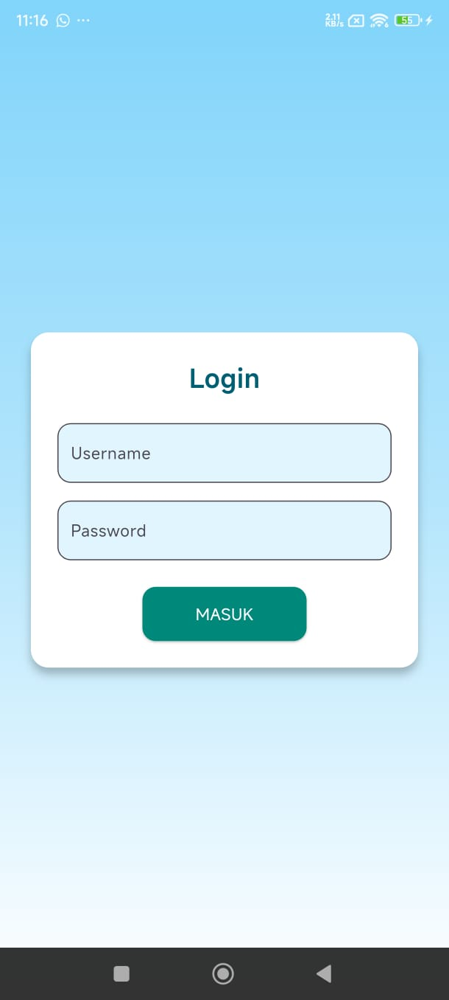
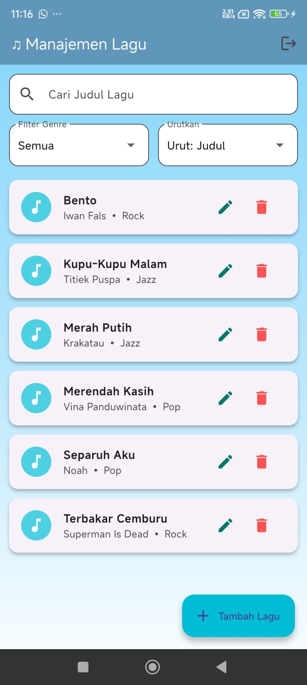
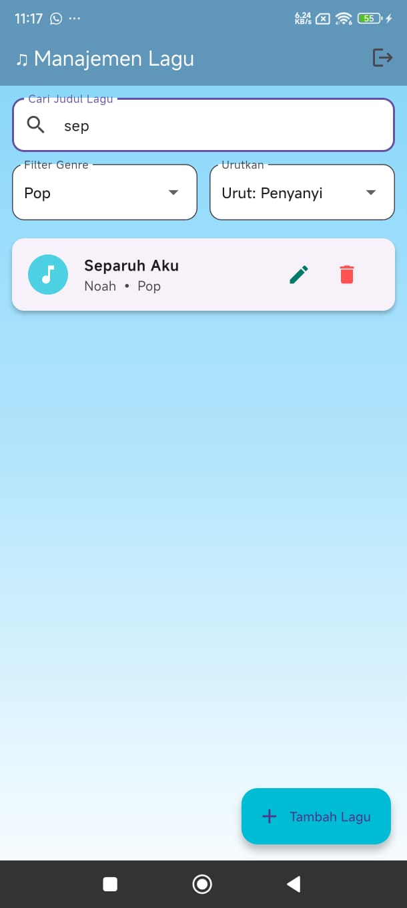
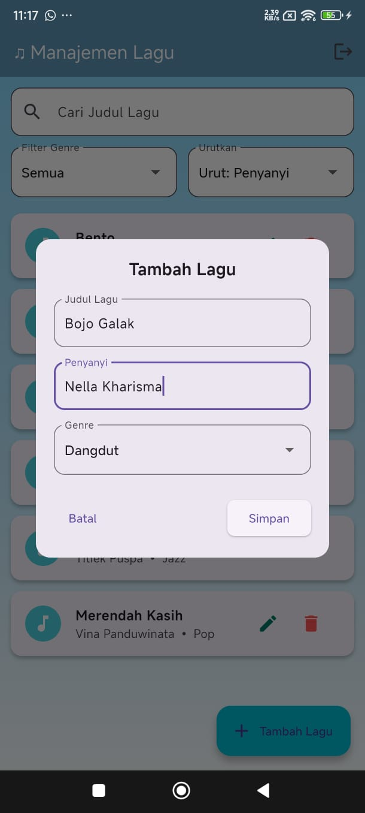
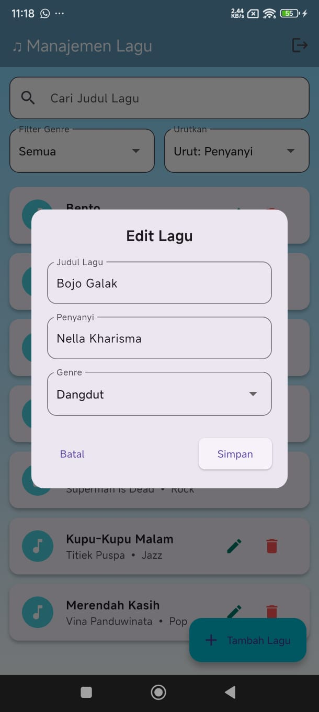

<<<<<<< HEAD
# 🎵 Sistem Manajemen Lagu

Aplikasi Flutter sederhana untuk mengelola daftar lagu secara lokal. Terdapat fitur login, pencarian, filter genre, sorting, serta tambah/edit/hapus lagu. Data tersimpan menggunakan `SharedPreferences`.

---

## 📱 Fitur Utama

✅ Login (statik)  
✅ Lihat daftar lagu  
✅ Tambah, edit, dan hapus lagu  
✅ Filter berdasarkan genre  
✅ Sorting berdasarkan judul / penyanyi  
✅ Data tersimpan secara lokal (offline)

---

## 🧭 Navigasi File

| File/Folder                             | Deskripsi                                                                 |
|----------------------------------------|---------------------------------------------------------------------------|
| `lib/main.dart`                        | Entry point aplikasi + cek status login                                  |
| `lib/screens/login_screen.dart`        | Halaman login (username: `admin`, password: `1234`)                      |
| `lib/screens/song_list_screen.dart`    | Halaman utama daftar lagu + fitur filter/sorting/tambah/edit/hapus      |
| `lib/screens/add_edit_song_screen.dart`| Dialog untuk tambah/edit lagu                                            |
| `lib/models/song.dart`                 | Model `Song` dan fungsi konversi ke/dari JSON                            |
| `screenshot/`                          | Folder berisi tangkapan layar aplikasi                                   |

---

## 🖼️ Screenshot

| Login | Home | Filter |
|-------|------|--------|
|  |  |  |

| Tambah Lagu | Edit Lagu |
|-------------|-----------|
|  |  |

---
=======
# IHP
>>>>>>> 818177cede1cfed3b5b699a63a9e0b61ba37e9d9
